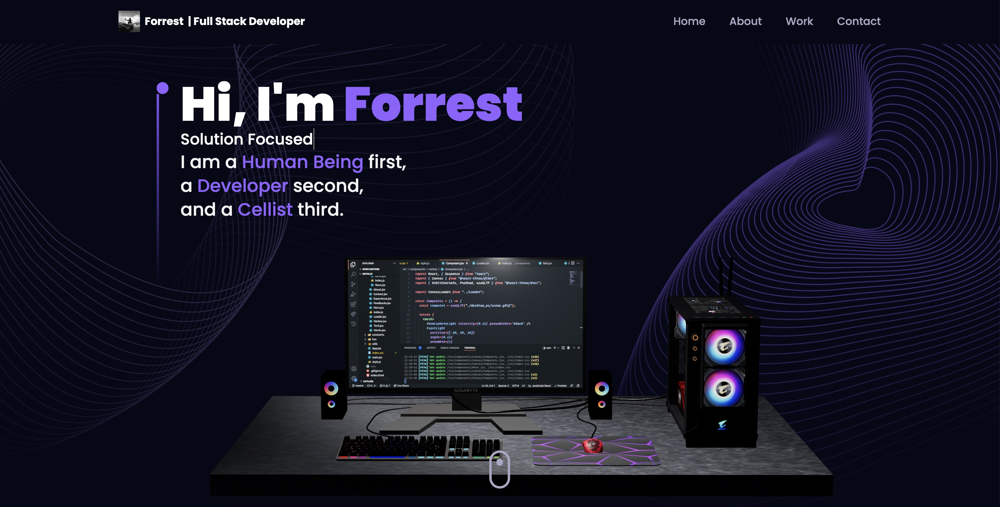

# Personal Portfolio
### ***You can visit the website here: https://forrest-lin.com***

This is a personal portfolio website for showcasing the work and skills of Forrest Lin.




## Technologies Used

- React.js
- React Router Dom
- Framer Motion
- React Three Fiber
- React Three Drei
- Three.js
- React Tilt
- React Vertical Timeline Component
- Sass
- TailwindCSS
- Vite.js

## Features

- Interactive 3D elements
- Smooth page transitions and animations
- Responsive design
- Contact form integration with EmailJS
- Vertical timeline for project showcases

## Installation and Setup

To set up the project locally, follow these steps:

1. Clone the repository:
```bash
git clone https://github.com/your-username/personal-portfolio.git
```

2. Change directory to the project folder:
```bash
cd personal-portfolio
```

3. Install the dependencies:
```bash
npm install
```

4. Start the development server:
```bash
npm run dev
```

The website should now be accessible at [http://localhost:5173](http://localhost:5173)

## Build and Deployment

To build the project for production, run the following command:
```bash
npm run build
```

This will generate the production-ready files in the `dist` folder. You can deploy these files to your preferred hosting service.

To preview the production build, run the following command:
```bash
npm run preview
```
This will start the preview server at [http://localhost:4173/](http://localhost:5173)

## Contributing

As this is a personal portfolio, contributions may not be necessary. However, if you have any suggestions or improvements, feel free to create a pull request or open an issue.

## License

This project is open source and available under the [MIT License](LICENSE).
